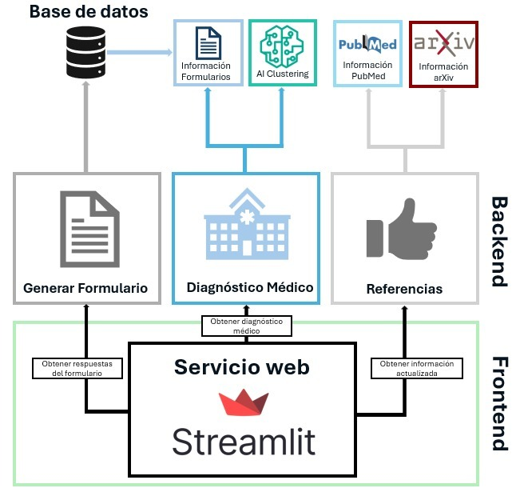

# Hackathon Boehringer Ingelheim: Dermatología de Precisión 

[]([https://pandem-ia-cyl.streamlit.app/](https://psoriassistpg.streamlit.app/))


## Contexto 

El Dr. Carlos, un dermatólogo apasionado, se encuentra ante un misterio médico: sus pacientes presentan síntomas desconcertantes que sugieren una enfermedad rara y compleja, la **Psoriasis Pustulosa Generalizada (PPG)**. Esta enfermedad autoinmune crónica causa pústulas dolorosas en la piel y puede afectar significativamente la calidad de vida de los pacientes. El camino hacia el diagnóstico es intrincado, y cada paso en falso puede retrasar el tratamiento crucial.


## Propuesta 

Ante este contexto proponemos `PsoriAssistPG`, una plataforma innovadora diseñada para apoyar a los dermatólogos en la orientación diagnóstica de pacientes con psoriasis, brindando una herramienta eficiente y especializada que centraliza el conocimiento clínico disponible. Esta solución tiene como objetivo optimizar el proceso de diagnóstico, proporcionando acceso a información crítica de manera rápida y precisa. 


Entre los principales beneficios de PsoriAssistPG se encuentran:

1. **Especialización**: Centrada exclusivamente en dermatología, PsoriAssistPG ofrece herramientas específicas para la evaluación y diagnóstico de trastornos cutáneos como la psoriasis, garantizando relevancia clínica.
   
2. **Optimización del Tiempo**: El cuestionario corto integrado junto con un sistema avanzado de clustering permite al dermatólogo orientar el diagnóstico de manera rápida y efectiva, reduciendo la carga de trabajo y mejorando la eficiencia en la consulta.

3. **Integración del Conocimiento**: La plataforma proporciona acceso directo a información médica actualizada, ayudando a los dermatólogos a tomar decisiones basadas en evidencia científica reciente.

4. **Análisis Centralizado**: A través de un dashboard intuitivo, PsoriAssistPG facilita el análisis global de datos, permitiendo identificar patrones clínicos y mejorar la precisión diagnóstica, promoviendo una atención más personalizada y efectiva para cada paciente.

Con PsoriAssistPG, los dermatólogos cuentan con una herramienta integral para mejorar su práctica clínica, optimizando tanto el diagnóstico como la toma de decisiones basadas en el conocimiento más reciente.

<div>
    

</div>


**El Reto**: Crear una herramienta digital que guíe al Dr. Carlos en el diagnóstico de la PPG. Esta herramienta debería permitirle recopilar datos de pacientes de manera eficiente, acceder a información actualizada sobre PPG y aprovechar algoritmos inteligentes para orientar su diagnóstico. Con esta herramienta, el Dr. Carlos podrá navegar por el complejo mundo de la PPG con mayor confianza, brindando a sus pacientes el diagnóstico preciso y oportuno que necesitan para recibir el tratamiento adecuado y mejorar su calidad de vida.

## Modulos

Este proyecto proporciona una plataforma integral para el diagnóstico y tratamiento de la Psoriasis Pustulosa Generalizada (PPG) con el objetivo de ayudar a los dermatólogos a tomar decisiones basadas en evidencia mediante un cuestionario, un dashboard de visualización y un sistema de recomendación basado en algoritmos. 

La aplicación esta implementada con una arquitectura multicapa con tres modulos: Formulario Detección, Diagnostico Médico y Referencias Actualizadas:


<div>
    

</div>


#### 1. Formulario de Detección
El formulario de detección consiste en un **Cuestionario Breve (13 preguntas)** dirigido al dermatólogo para recoger información relevante sobre síntomas, antecedentes clínicos y factores desencadenantes de PPG.

**Resultado**: Los datos introducidos en el cuestionario se procesan para generar una clasificación inicial del paciente en función de la probabilidad de padecer PPG:
  * **Probablemente**: Posible Confirmación de PPG.
  * **Sospecha**: Sospecha Moderada de PPG.
  * **No**: Baja Probabilidad de PPG.

#### 2. Valoración Global: Dashboard de Visualización y Soporte
La sección de diagnóstico médico incluye un **Dashboard de Visualización y Soporte**, proporcionando una interfaz interactiva que facilita a los dermatólogos la gestión de los datos del paciente, el diagnóstico, el tratamiento y la toma de decisiones informadas. Este módulo integra las siguientes funcionalidades:

- **Visualización de Casos**: El dermatólogo puede analizar patrones clínicos y epidemiológicos a partir de las respuestas recolectadas de los cuestionarios de diferentes pacientes. Los datos se presentan en un panel interactivo que permite una exploración detallada y rápida.
  
- **Gráfico de Barras de Respuestas**: Un gráfico de barras muestra el total de respuestas por cada pregunta, desglosando las respuestas en categorías como "Sí", "No", "No sabe". Esto permite identificar rápidamente las áreas de consenso o incertidumbre en el diagnóstico.

- **Guías Diagnósticas y Terapéuticas**: El dashboard ofrece sugerencias basadas en protocolos diagnósticos y terapéuticos actualizados, proporcionando información clave para el tratamiento del paciente.

- **Algoritmo Inteligente de Recomendación**: Basado en un modelo de **KMeans**, este algoritmo sugiere pacientes similares a partir de los resultados de un paciente en particular. Utiliza agrupación de pacientes con características y respuestas similares para facilitar el diagnóstico diferencial.

#### 3. Acceso a Recursos Científicos

El módulo de **referencias científicas** permite a los usuarios buscar artículos científicos sobre Psoriasis Pustulosa Generalizada (PPG) directamente desde la interfaz de la aplicación. Los usuarios pueden:

- Ingresar términos de búsqueda (como "Psoriasis", "PPG").
- Seleccionar palabras clave adicionales como "consensus", "guideline", o "clinical trial".
- Establecer un rango de años y elegir la fuente de datos (arXiv o PubMed).
- Configurar el número de resultados a mostrar.


## Estructura del Repositorio

### 1. **`app/`**  
Directorio principal con el código de la aplicación, que incluye:

- **`app.py`**: Punto de entrada que inicializa y ejecuta la aplicación, gestionando rutas y lógica principal.
- **`form/`**: Funcionalidades dedicadas al medico para que rellene el formulario de pacientes, permitiendo registrar información sobre síntomas, historial médico, y otros detalles relevantes para el diagnóstico de la PPG.
    - **`frontend/`**: Archivos y componentes del frontend para la interfaz del formulario de pacientes.
    - **`backend/`**: Módulos del backend que gestionan la recopilación y validación de datos del formulario.
- **`medico/`**: Módulos relacionados con profesionales médicos, como gestión de datos y análisis.
    - **`frontend/`**: Componentes del frontend relacionados con la interfaz para médicos, mostrando datos y resultados del diagnóstico.
    - **`backend/`**: Lógica que gestiona el análisis de los datos médicos y proporciona recomendaciones para el diagnóstico.
- **`static/`**: Recursos estáticos para el frontend (imágenes, CSS, JavaScript, etc.).
- **`ai/`**: Algoritmo Inteligente que apartir de un paciente propone pacientes similares.
   - **`frontend/`**: Desarrollado con `seaborn` y `matplotlib`.
    - **`backend/`**: Desarrollado con `sklearn`. Usa los algoritmos de PCA y KMeans.
- **`db/`**: Bases de datos rapida, creada con archivos csvs.
- **`dummy/`**: Generacion de datos fake.


### 2. **`docs/`**
Un directorio para archivos de documentación. Puede incluir especificaciones de diseño, guías técnicas, documentación de API u otros recursos para ayudar a los desarrolladores a entender y trabajar con el proyecto.

### 3. **`organizacion/`**
Un directorio para archivos de organizacion. Incluye la matrix RACI del proyecto asi como una To-Do list siguiendo metodología AGILE.


## Cómo Lanzar la Aplicación


### Requisitos Previos
- Python 3.x instalado en tu sistema.
- Dependencias relevantes instaladas (usa `pip install -r requirements.txt` si se agrega un archivo `requirements.txt`).

### Ejecución de la Aplicación
1. Navega al directorio `app`.
2. Ejecuta el archivo `app.py` usando el comando:

```bash
   python app.py
```

### Ideas

- Herramienta de ayuda al diagnostico rapido de la enfermedad - 

### Herramientas

- Google docs: Documentación 
- [Canva](https://www.canva.com/): logo 
- Powerpoint 
- Github: Codigo y gestión de equipo y tareas
- [App Gather](https://app.gather.town/): Comunicación


## Cómo Ejecutar y Usar la Aplicación

### Requisitos Previos
- Python 3.10
- `pipenv` (gestor de dependencias de Python)

### Configuración

1. Clona el repositorio y navega a su carpeta:
   ```bash
   git clone <repository-url>
   cd <repository-folder>
   ```
2. Instala las dependencias:
   ```bash
   pipenv install
   ```

### Ejecutando la Aplicación
1. Activa el entorno:
   ```bash
   pipenv shell
   ```
2. Inicia la aplicación:
   ```bash
   pipenv run app
   ```
   La aplicación se abrirá en tu navegador en:  
   `http://localhost:8501`

### Salir
- Detén la aplicación con `Ctrl+C`.
- Sal del entorno:

```bash
exit
```

### Reconocimientos

Desarrollado por Álvaro García Barragán, Alberto González Calatayud, Eduardo Martín Ruiz, Laura Masa Martínez y Enrique Solera Navarro.
<div style="text-align: center; padding: 20px; margin-top: 50px;">
        <hr>
        <p>© 2024 PsoriAssistGG</p>
 </div>
